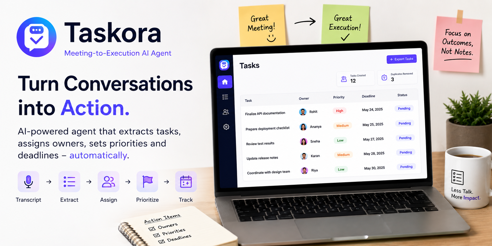

# 🚀 Taskora – Meeting-to-Execution AI Agent

> Transform meeting conversations into actionable tasks, assign ownership, prioritize work, and track execution automatically.



## 🎯 Problem Statement

Teams spend hours in meetings, but action items often get lost in notes, chats, and memory.

Common challenges:

- Important tasks are forgotten
- No clear ownership
- Deadlines are not tracked
- Duplicate work happens across teams
- Meeting notes rarely translate into execution

Taskora bridges the gap between **discussion and execution** by converting meeting transcripts into structured, actionable tasks.

---

## 💡 Solution

Taskora is an AI-powered Meeting-to-Execution Agent that automatically:

✅ Processes meeting transcripts

✅ Extracts action items

✅ Identifies task owners

✅ Assigns priorities

✅ Detects deadlines

✅ Removes duplicate tasks

✅ Generates an execution-ready task dashboard

Instead of manually reviewing meeting notes, teams instantly receive a structured action plan.

---

## 🏗️ Architecture

```text
Meeting Transcript
        │
        ▼
┌──────────────────────┐
│ Transcription Agent  │
└──────────────────────┘
        │
        ▼
┌──────────────────────┐
│ Action Extraction    │
│ Agent (Gemini)       │
└──────────────────────┘
        │
        ▼
┌──────────────────────┐
│ Owner Assignment     │
│ Agent                │
└──────────────────────┘
        │
        ▼
┌──────────────────────┐
│ Priority & Deadline  │
│ Detection            │
└──────────────────────┘
        │
        ▼
┌──────────────────────┐
│ Duplicate Detection  │
└──────────────────────┘
        │
        ▼
┌──────────────────────┐
│ Task Creation Agent  │
└──────────────────────┘
        │
        ▼
Execution Dashboard
```

---

## 🤖 AI Agents

### 1️⃣ Transcription Agent

Responsible for:

- Cleaning transcript data
- Speaker identification
- Structuring conversations

---

### 2️⃣ Action Extraction Agent

Uses Gemini to identify:

- Tasks
- Deliverables
- Follow-ups
- Commitments made during meetings

Example:

**Input**

```text
Rahul will prepare deployment documentation by Friday.
```

**Output**

```json
{
  "task": "Prepare deployment documentation"
}
```

---

### 3️⃣ Owner Assignment Agent

Determines:

- Responsible stakeholder
- Team member ownership

Example:

```json
{
  "owner": "Rahul"
}
```

---

### 4️⃣ Priority Detection Agent

Classifies tasks into:

- High
- Medium
- Low

Based on urgency indicators and task context.

---

### 5️⃣ Deadline Detection Agent

Extracts timeline information:

```text
Tomorrow
Friday
Next Week
End of Day
```

and converts them into structured deadlines.

---

### 6️⃣ Duplicate Detection Agent

Prevents repeated work by identifying similar action items before task creation.

---

## ⚙️ Tech Stack

| Category | Technology |
|-----------|------------|
| LLM | Gemini |
| Framework | Python |
| Agent Architecture | Google ADK Inspired |
| Data Models | Dataclasses |
| Logging | Custom Pipeline Logger |
| Output | JSON / Dashboard Ready |
| Environment | Jupyter Notebook |

---

## 🔄 Workflow

```text
Meeting Ends
      │
      ▼
Transcript Uploaded
      │
      ▼
Taskora Processes Transcript
      │
      ▼
Tasks Extracted
      │
      ▼
Owners Assigned
      │
      ▼
Deadlines Identified
      │
      ▼
Duplicates Removed
      │
      ▼
Execution Dashboard Generated
```

---

## 📊 Example Output

```json
[
  {
    "task": "Prepare deployment documentation",
    "owner": "Rahul",
    "priority": "High",
    "deadline": "Friday",
    "status": "Pending"
  },
  {
    "task": "Finalize API testing",
    "owner": "Ananya",
    "priority": "Medium",
    "deadline": "Next Week",
    "status": "Pending"
  }
]
```

---

## 🌟 Key Features

### Automated Action Item Extraction

No manual note-taking required.

### Ownership Tracking

Every task gets a responsible owner.

### Priority Classification

Teams know what matters most.

### Deadline Detection

Ensures accountability.

### Duplicate Prevention

Reduces redundant work.

### Structured Execution Pipeline

Converts conversations into measurable outcomes.

---

## 🎥 Demo Scenario

### Meeting Discussion

```text
John will finish authentication APIs by Friday.

Sarah will prepare release notes.

The deployment checklist must be finalized before launch.
```

### Taskora Output

| Task | Owner | Priority | Deadline |
|--------|--------|--------|--------|
| Finish Authentication APIs | John | High | Friday |
| Prepare Release Notes | Sarah | Medium | Not Specified |
| Finalize Deployment Checklist | Unassigned | High | Before Launch |

---

## 🚀 Future Enhancements

- Jira Integration
- Notion Integration
- Slack Notifications
- Email Follow-Ups
- Calendar Sync
- Voice Meeting Ingestion
- Embedding-based Duplicate Detection
- Multi-Agent Collaboration using ADK
- Real-Time Meeting Monitoring

---

## 🏆 Hackathon Impact

### Time Saved

Reduce manual meeting follow-up effort by **80%+**

### Improved Accountability

Every task receives ownership and tracking.

### Faster Execution

Move directly from discussion to execution.

### Better Team Coordination

Ensure no action item gets lost after meetings.

---

## 👥 Team

Built with ❤️ for hackathons and productivity-driven teams.

**Taskora**
*From Meeting Notes to Execution.*
